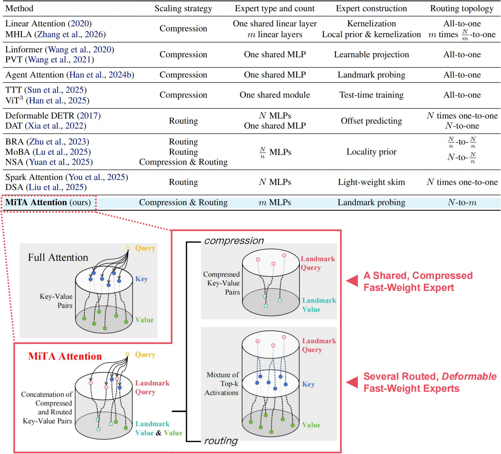

<div align="center">
<h1>MiTA Attention</h1>
</div>

This repository is the official PyTorch implementation of the paper:
[MiTA Attention: Efficient Fast-Weight Scaling via a Mixture of Top-k Activations](https://arxiv.org/abs/2602.01219v3).

MiTA Attention is a novel efficient attention mechanism that adopts a **compress-and-route strategy**, consisting of a compressed shared fast-weight expert and several routed **deformable** fast-weight experts.

<p align="center">
    
<br> <em>Overview of MiTA Attention </em>
<p align="center">

## 📊 Model Zoo

| Model      | Top-1 Acc | FLOPs  | #Params | Checkpoint |
|:------------:|----------------------:|--------:|--------:|:---------:|
| MiTA-DeiT-Tiny     | 71.1%                | 1.1G   | 5.7M    | [link](https://drive.google.com/drive/folders/1KnFqHpJLc_NddIjKnRJEb9McQjN4DXgk?usp=sharing) |
| MiTA-DeiT-Tiny$`^\textrm{DWC}`$     | 73.4%                | 1.1G   | 5.7M    | [link](https://drive.google.com/drive/folders/1tE5yqWgVsouxuF9nGV3xDA2bVb2bEY3H?usp=sharing) |
| MiTA-DeiT-Small     | 79.8%                | 4.4G  | 22M   | [link](https://drive.google.com/drive/folders/175gOzODWbS_6sap-tXz-9ufh8-y2Mq7k?usp=sharing) |
| MiTA-DeiT-Small$`^\textrm{DWC}`$     | 80.6%                | 4.4G  | 22M   | [link](https://drive.google.com/drive/folders/19zgljz3g8Dnbn43Zvksk6BY00LNBFCK9?usp=sharing) |
| MiTA-DeiT-Small$`^\textrm{DWC,Gate}`$     | 81.2%                | 4.7G  | 22M   | [link](https://drive.google.com/drive/folders/1ThZ8F2MsY3DU2chGWkvrXEM2fR1ACqQv?usp=sharing) |
| MiTA-ViT-5-Small     | 81.3%                | 4.5G  | 22M   | [link](https://drive.google.com/drive/folders/1a1TWIAa8sljpzXkHxf567b5GLGmGL1Xy?usp=sharing) |
| MiTA-ViT-5-Small$`^\textrm{DWC}`$     | 81.7%                | 4.5G  | 22M   | [link](https://drive.google.com/drive/folders/1CiFFsO5b-mHPZDhUH6jf0HFJxjwWbDgT?usp=sharing) |

## 🔧 Usage
We provide a pure implementation of MiTA Attention in package [mita](https://github.com/QishuaiWen/MiTA/tree/main/mita), which can be a plug-in module in other tasks.

For exmaple:
```
# make sure that flash-attn==2.6.3 is installed before using MiTA Attention
from mita import MiTA_Attention
attention_mita = MiTA_Attention(dim=384, num_heads=6)
x = torch.randn(1, 256, 384)
x = block(x)
```
Additionally, there are many variants of MiTA Attention as well as other classical/newest efficient attention in the mita package. 
Interested users can check them out and use them. Stay tuned for more integrated implementations in the future.

We also release the code of:
+ MiTA-DeiT [[README](https://github.com/QishuaiWen/MiTA/blob/main/MiTA-DeiT/README.md)]: DeiT models with MiTA Attention for image classification;
+ MiTA-ViT-5 [[README](https://github.com/QishuaiWen/MiTA/blob/main/MiTA-ViT-5/README.md)]: ViT-5 models with MiTA Attention for image classification;
+ MiTA-Segmenter [[README](https://github.com/QishuaiWen/MiTA/blob/main/MiTA-Segmenter/README.md)]: Segmenter models with MiTA Attention for semantic segmentation.

## 🔄 Updates
[2026/3/5] The lastest version ([v3](https://arxiv.org/abs/2602.01219v3)) of our paper includes improved experiments.

[2026/2/3] Released a pure implementation of MiTA attention at [here](https://github.com/QishuaiWen/MiTA/tree/main/MiTA%20Attention).

[2026/2/1] Our paper is now publicly available on arXiv ([v1](https://arxiv.org/abs/2602.01219v1)).

## Citation
If you find this repo helpful, please consider citing us.
```
@article{wen2026mita,
  title={MiTA Attention: Efficient Fast-Weight Scaling via a Mixture of Top-$k$ Activations},
  author={Wen, Qishuai and Huang, Zhiyuan and Meng, Xianghan and He, Wei and Li, Chun-Guang},
  journal={arXiv preprint arXiv:2602.01219},
  year={2026}
}
```
