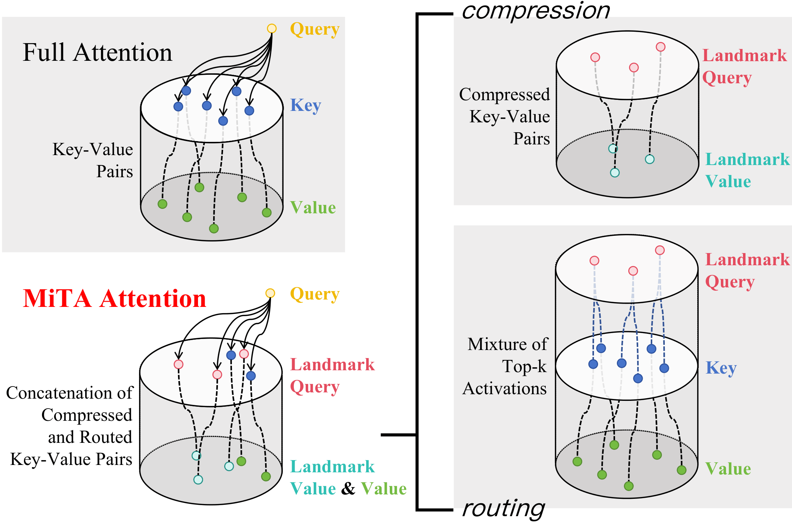

# MiTA: Efficient Fast-Weight Scaling via a Mixture of Top-k Activations

    
  <em>MiTA Attention </em>

## 🔄 Updates
[2026/3/5] The lastest version of paper now includes better experimental results.

[2026/2/3] Released a pure implementation MiTA attention at [here](https://github.com/QishuaiWen/MiTA/tree/main/MiTA%20Attention).

[2026/2/1] The first version of our paper is now publicly available on [arXiv](https://arxiv.org/abs/2602.01219).
