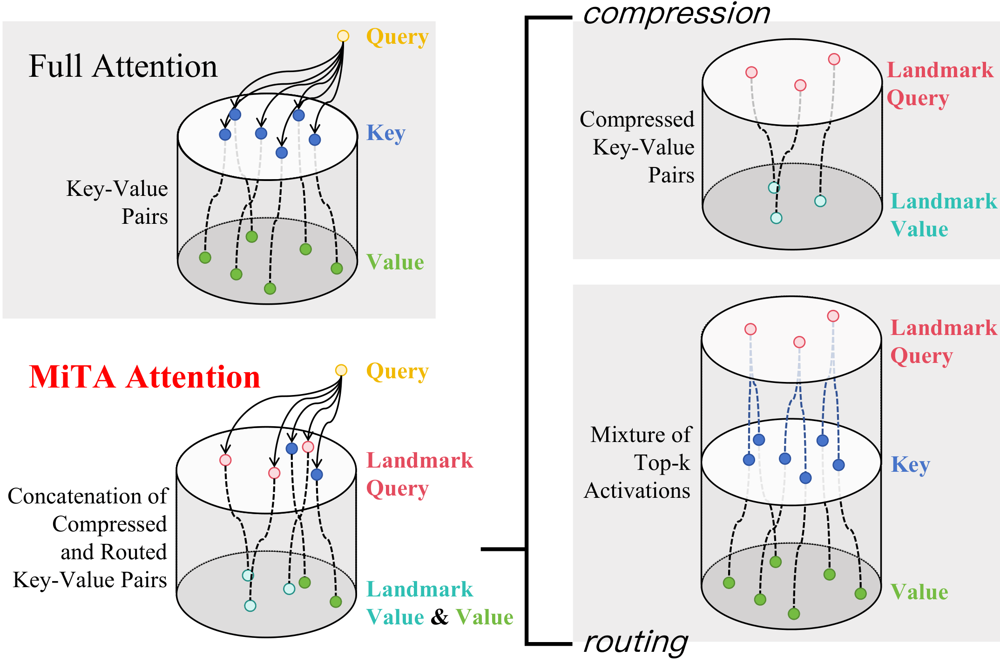
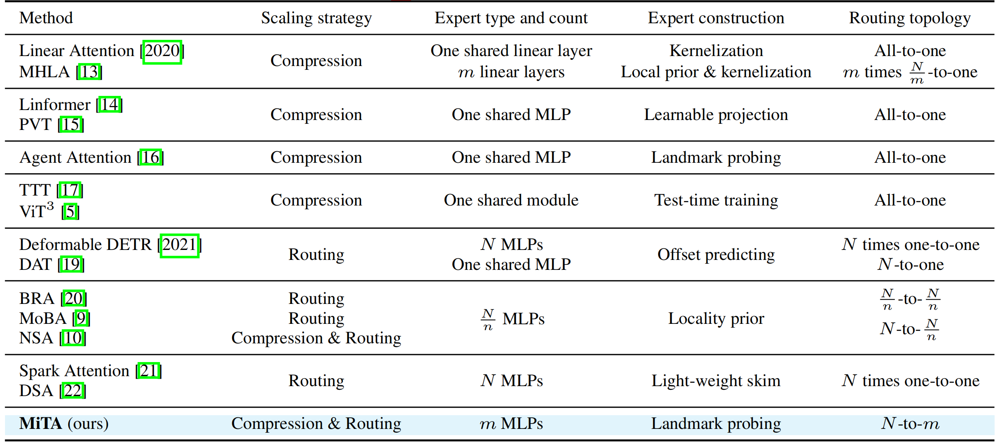
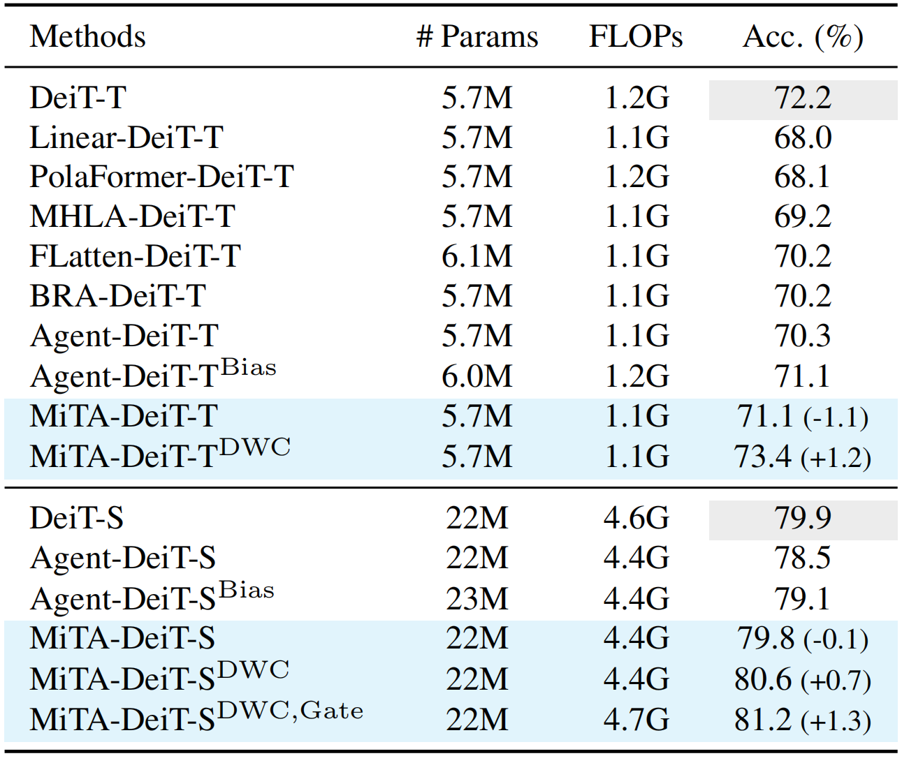
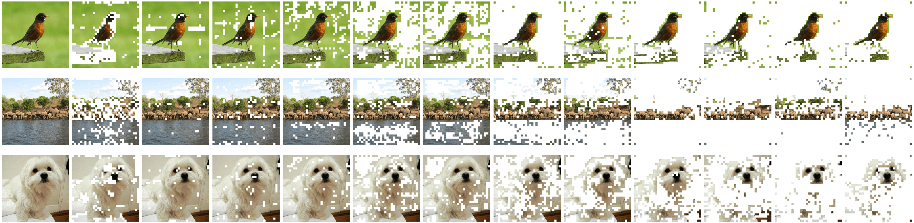

<div align="center">
<h1>Mixture-of-Top-k Attention (MiTA)</h1>
</div>

This repository is the official PyTorch implementation of our NeurIPS 2026 paper:
+ Mixture-of-Top-k Attention: Efficient Attention via Scalable Fast Weights
[[arXiv](https://arxiv.org/abs/2602.01219v5)].

This is our third work on principled and efficient attention design. See our previous works:
+ DEPICT (NeurIPS 2024) [[github](https://github.com/QishuaiWen/DEPICT) | [arXiv](https://arxiv.org/abs/2411.03033)];
+ CBSA (NeurIPS 2025 Spotlight) [[github](https://github.com/QishuaiWen/CBSA) | [arXiv](https://arxiv.org/abs/2509.16875)].

**Mi**xture-of-**T**op-k **A**ttention (**MiTA**) is a novel attention mechanism that adopts a fast-weight perspective to unify prior efficient attention methods and identify their limitations. Specifically, MiTA improves the flexibility of prior MoE attention from rigid to **deformable fast-weight experts**, as well as the scalability of prior top-k attention from query-specific set to **reusable top-k set**.

<p align="center">
    
<br> <em>Overview of MiTA</em>
<p align="center">

## 📣 News
[2026/9/25] Our paper has been accepted to NeurIPS 2026! 

## 🌟 Highlights
+ A five-dimensional taxonomy for efficient attention methods:

<p align="center">
    
<br> <em>A unifying taxonomy from a fast-weight perspective</em>
<p align="center">
  
+ Supervisor performance on vision tasks:

<p align="center">
    
<br> <em>Comparisons on ImageNet-1K</em>
<p align="center">
  
+ An emergent token pruning effect of MiTA:
  
<p align="center">
    
<br> <em>The token pruning effect of MiTA</em>
<p align="center">

## 🔧 Usage
We provide a pure implementation of MiTA in the package [mita](https://github.com/QishuaiWen/MiTA/tree/main/mita), which can be a plug-in module in other tasks.

For example:
```
# make sure that flash-attn==2.6.3 is installed before using MiTA
from mita import MiTA_Attention
attention_mita = MiTA_Attention(dim=384, num_heads=6)
x = torch.randn(1, 256, 384)
x = block(x)
```
Additionally, there are many variants of MiTA as well as other classical/newest efficient attention mechanisms in the mita package. 
Interested users can check them out and use them. Stay tuned for more integrated implementations in the future.

We also release the code for:
+ MiTA-DeiT [[README](https://github.com/QishuaiWen/MiTA/blob/main/MiTA-DeiT/README.md)]: DeiT models with MiTA for image classification;
+ MiTA-ViT-5 [[README](https://github.com/QishuaiWen/MiTA/blob/main/MiTA-ViT-5/README.md)]: ViT-5 models with MiTA for image classification;
+ MiTA-Segmenter [[README](https://github.com/QishuaiWen/MiTA/blob/main/MiTA-Segmenter/README.md)]: Segmenter models with MiTA for semantic segmentation.

## 📊 Model Zoo

| Model      | Top-1 Acc | FLOPs  | #Params | Checkpoint |
|:------------:|----------------------:|--------:|--------:|:---------:|
| MiTA-DeiT-Tiny     | 71.1%                | 1.1G   | 5.7M    | [link](https://drive.google.com/drive/folders/1KnFqHpJLc_NddIjKnRJEb9McQjN4DXgk?usp=sharing) |
| MiTA-DeiT-Tiny$`^\textrm{DWC}`$     | 73.4%                | 1.1G   | 5.7M    | [link](https://drive.google.com/drive/folders/1tE5yqWgVsouxuF9nGV3xDA2bVb2bEY3H?usp=sharing) |
| MiTA-DeiT-Small     | 79.8%                | 4.4G  | 22M   | [link](https://drive.google.com/drive/folders/175gOzODWbS_6sap-tXz-9ufh8-y2Mq7k?usp=sharing) |
| MiTA-DeiT-Small$`^\textrm{DWC}`$     | 80.6%                | 4.4G  | 22M   | [link](https://drive.google.com/drive/folders/19zgljz3g8Dnbn43Zvksk6BY00LNBFCK9?usp=sharing) |
| MiTA-DeiT-Small$`^\textrm{DWC,Gate}`$     | 81.2%                | 4.7G  | 22M   | [link](https://drive.google.com/drive/folders/1ThZ8F2MsY3DU2chGWkvrXEM2fR1ACqQv?usp=sharing) |
| MiTA-ViT-5-Small     | 81.3%                | 4.5G  | 22M   | [link](https://drive.google.com/drive/folders/1a1TWIAa8sljpzXkHxf567b5GLGmGL1Xy?usp=sharing) |
| MiTA-ViT-5-Small$`^\textrm{DWC}`$     | 81.7%                | 4.5G  | 22M   | [link](https://drive.google.com/drive/folders/1CiFFsO5b-mHPZDhUH6jf0HFJxjwWbDgT?usp=sharing) |

## Citation
If you find this repo helpful, please consider citing us.
```
@article{wen2026mixture,
  title={Mixture-of-Top-k Attention: Efficient Attention via Scalable Fast Weights},
  author={Wen, Qishuai and Huang, Zhiyuan and Meng, Xianghan and He, Wei and Li, Chun-Guang},
  journal={arXiv preprint arXiv:2602.01219},
  year={2026}
}
```
